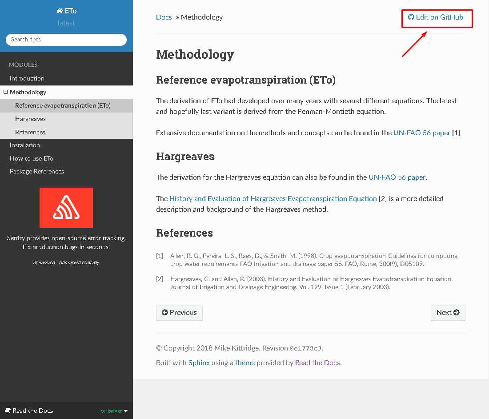
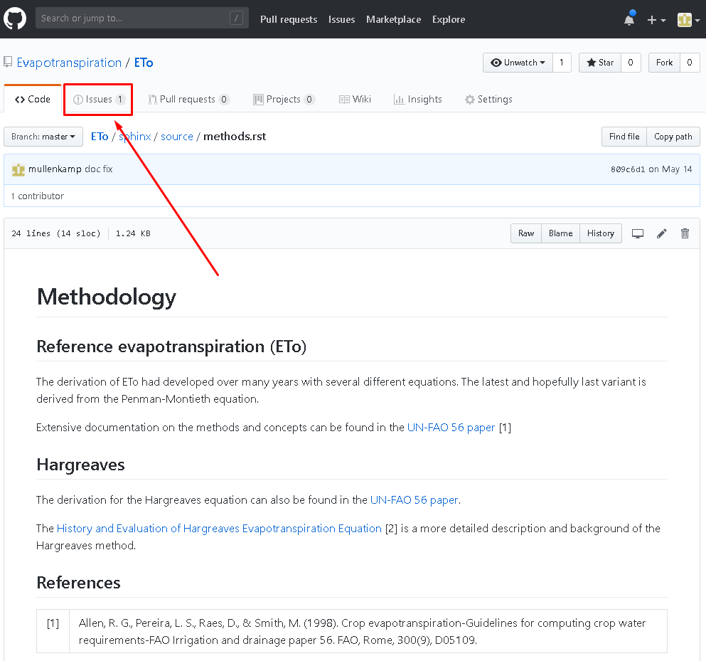
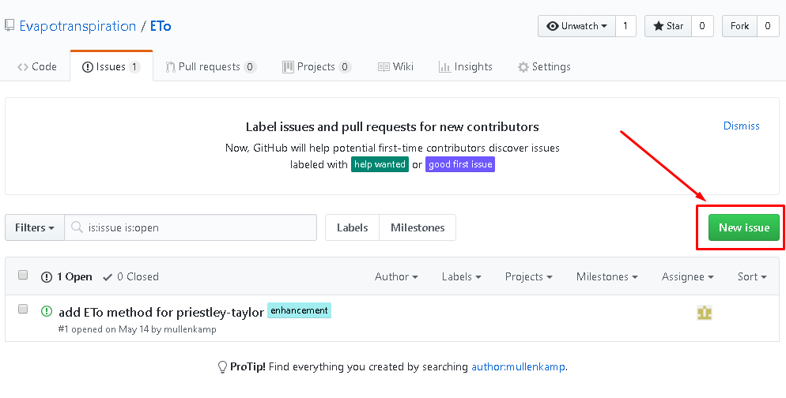
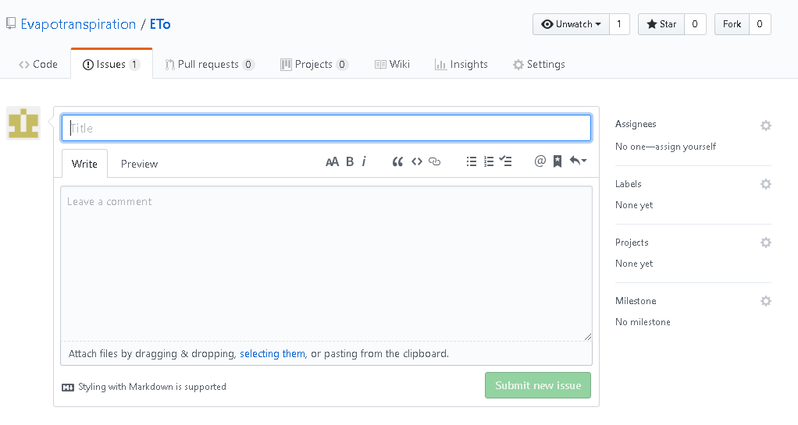

How to contribute
=================

We highly encourage contributing to the Data-to-Knowledge projects. In fact, that's one of the key goals.
There are two main ways to contribute to Data-to-Knowledge projects and this depends on time availability and programming knowledge.

Suggestions for edits/additions
-------------------------------
If you'd like to request a change or addition to either the website document or the code itself, then it is recommended to go through the Github issue tracker.

To do this, first go to the project website and click on the "Edit in Github" link at the top right of the screen:

This will bring you to the Github repository for the project. Then go to the "Issues" tab:

From there you can see existing "issues" that others have added. If your issue has not already been brought up, then you can add a new one via the "New Issue" button:

Then give it a title and leave your comments:

For additional functionality in the Github issue tracking, please look at the `official Github guides <https://guides.github.com/features/issues/>`_.
